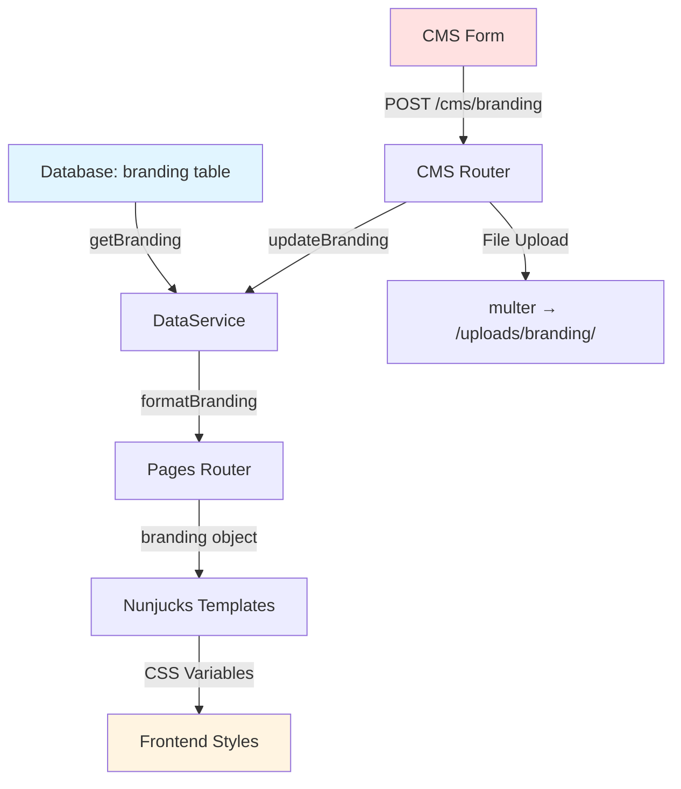

# CMS Visual Controls - Technical Documentation

## Overview
This document maps how the CMS branding system (`id="cms-branding-form"`) controls visual elements across the UHA News website. The system allows administrators to customize site name, colors, and logos through a centralized interface.

---

## Data Flow Architecture



---

## 1. Database Layer

### Schema: `branding` Table
**Location**: [`server/services/data-service.js`](file:///e:/Projeler/UHAWebSitesi/server/services/data-service.js)

| Column | Type | Default | Description |
|--------|------|---------|-------------|
| `id` | TEXT | `'branding'` | Primary key (singleton) |
| `siteName` | TEXT | `'UHA News'` | Site display name |
| `primaryColor` | TEXT | `'#1a365d'` | Primary brand color (headers, buttons) |
| `secondaryColor` | TEXT | `'#2d3748'` | Secondary color (backgrounds) |
| `accentColor` | TEXT | `'#3182ce'` | Accent color (links, notifications) |
| `logoTextColor` | TEXT | `'#3182ce'` | Color of the "UHA" text in the header logo. |
| `navTextColor` | TEXT | `'#ffffff'` | Text color for navigation links and footer section titles. |
| `navBackgroundColor` | TEXT | `'#1a365d'` | Background color of the main navigation bar. |
| `headerLogo` | TEXT | `''` | Path to header logo image |
| `footerLogo` | TEXT | `''` | Path to footer logo image |
| `updatedAt` | TEXT | ISO timestamp | Last modification time |

**Key Methods**:
- `getBranding()` - Retrieves branding data with defaults
- `updateBranding(brandingData)` - Updates branding and returns refreshed data
- `ensureBrandingDefaults()` - Ensures default row exists on initialization

---

## 2. Backend API Endpoints

### GET `/cms/branding`
**Location**: [`server/routes/cms.js:243-251`](file:///e:/Projeler/UHAWebSitesi/server/routes/cms.js#L243-L251)

**Purpose**: Fetch current branding configuration for CMS

**Response**:
```json
{
  "branding": {
    "siteName": "UHA News",
    "primaryColor": "#1a365d",
    "secondaryColor": "#2d3748",
    "accentColor": "#3182ce",
    "logoTextColor": "#3182ce",
    "navTextColor": "#ffffff",
    "navBackgroundColor": "#1a365d",
    "headerLogo": "/uploads/branding/header-logo-1234567890.png",
    "footerLogo": "/uploads/branding/footer-logo-1234567890.png"
  }
}
```

**Path Normalization**: Converts filesystem paths to web paths (`/uploads/branding/...`)

---

### POST `/cms/branding`
**Location**: [`server/routes/cms.js:257-311`](file:///e:/Projeler/UHAWebSitesi/server/routes/cms.js#L257-L311)

**Purpose**: Update branding configuration with optional logo uploads

**Request**: `multipart/form-data`

**Form Fields**:
| Field | Type | Description |
|-------|------|-------------|
| `siteName` | text | Site name |
| `primaryColor` | text | Hex color code |
| `secondaryColor` | text | Hex color code |
| `accentColor` | text | Hex color code |
| `logoTextColor` | text | Hex color code |
| `navTextColor` | text | Hex color code |
| `navBackgroundColor` | text | Hex color code |
| `headerLogo` | file | Header logo image (PNG/JPEG/WEBP/SVG, max 3MB) |
| `footerLogo` | file | Footer logo image (PNG/JPEG/WEBP/SVG, max 3MB) |

**File Upload Handling**:
- **Storage**: `public/uploads/branding/`
- **Naming**: `header-logo-{timestamp}.{ext}` or `footer-logo-{timestamp}.{ext}`
- **Cleanup**: Old logo files are automatically deleted on replacement
- **Validation**: 3MB max size, image formats only

**Response**:
```json
{
  "success": true,
  "branding": { /* updated branding object */ }
}
```

---

## 3. CMS Frontend Form

### Form Template
**Location**: [`templates/cms/components/branding-form.njk`](file:///e:/Projeler/UHAWebSitesi/templates/cms/components/branding-form.njk)

**Form ID**: `cms-branding-form`

**Form Fields**:

#### Text Input
```html
<input name="siteName" type="text" value="{{ branding.siteName or 'UHA News' }}">
```

#### Color Pickers
```html
<input name="primaryColor" type="color" 
       value="{{ branding.primaryColor or '#1a365d' }}" 
       data-branding-color="primary">
<input name="secondaryColor" type="color" 
       value="{{ branding.secondaryColor or '#2d3748' }}" 
       data-branding-color="secondary">
<input name="accentColor" type="color" 
       value="{{ branding.accentColor or '#3182ce' }}" 
       data-branding-color="accent">
<input name="logoTextColor" type="color" 
       value="{{ branding.logoTextColor or '#3182ce' }}" 
       data-branding-color="logoText">
<input name="navTextColor" type="color" 
       value="{{ branding.navTextColor or '#ffffff' }}" 
       data-branding-color="navText">
<input name="navBackgroundColor" type="color" 
       value="{{ branding.navBackgroundColor or '#1a365d' }}" 
       data-branding-color="navBg">
```

#### File Uploads
```html
<input name="headerLogo" type="file" 
       accept="image/png, image/jpeg, image/webp, image/svg+xml"
       data-branding-upload="header">
<input name="footerLogo" type="file" 
       accept="image/png, image/jpeg, image/webp, image/svg+xml"
       data-branding-upload="footer">
```

### Live Preview Panel
**Location**: [`templates/cms/components/branding-form.njk:69-97`](file:///e:/Projeler/UHAWebSitesi/templates/cms/components/branding-form.njk#L69-L97)

**Elements**:
- `[data-cms="branding-preview-header"]` - Header preview with primary color background
- `[data-cms="branding-preview-footer"]` - Footer preview with secondary color background
- `[data-cms="branding-preview-body"]` - Body preview with accent color border
- `[data-cms="branding-preview-chip"]` - Color chips showing current values

---

## 4. Client-Side JavaScript

### CMS App Handler
**Location**: [`public/cms/js/cms-app.js`](file:///e:/Projeler/UHAWebSitesi/public/cms/js/cms-app.js)

**Key Methods**:

#### `populateBrandingForm(branding)` (Line 529-563)
Populates form fields with branding data and updates preview

#### `handleBrandingColorInput(event)` (Line 660-670)
Real-time color picker handler:
- Updates color value display
- Updates preview panel colors
- Updates state object

#### `handleBrandingFileInput(event)` (Line 672-704)
File input handler:
- Creates object URL for instant preview
- Replaces placeholder with image element
- Handles both header and footer logos

#### `saveBranding()` (Line 706-738)
Form submission handler:
```javascript
const formData = new FormData(this.brandingForm);
const response = await fetch('/cms/branding', {
  method: 'POST',
  body: formData
});
```

**Event Listeners**:
```javascript
// Color inputs
this.brandingColorInputs.forEach(input => {
  input.addEventListener('input', this.handleBrandingColorInput.bind(this));
});

// File inputs
this.brandingFileInputs.forEach(input => {
  input.addEventListener('change', this.handleBrandingFileInput.bind(this));
});

// Form submission
submitButton.addEventListener('click', () => this.saveBranding());
```

---

## 5. Frontend Visual Application

### CSS Variable Injection
**Location**: [`templates/layouts/base.njk:32-38`](file:///e:/Projeler/UHAWebSitesi/templates/layouts/base.njk#L32-L38)

```html
<style id="branding-variables">
  :root {
    --primary-color: {{ primary_color }};
    --secondary-color: {{ secondary_color }};
    --accent-color: {{ accent_color }};
    --logo-text-color: {{ brand.logoTextColor or '#3182ce' }};
    --nav-text-color: {{ brand.navTextColor or '#ffffff' }};
    --nav-background-color: {{ brand.navBackgroundColor or '#1a365d' }};
  }
</style>
```

**Template Variables** (Lines 4-8):
```nunjucks





```

### Logo Usage
**Locations**: All page templates

**Header Logo**:
```nunjucks

  

  <span>{{ brand.siteName }}</span>

```

**Footer Logo**:
```nunjucks

  

  {# Falls back to headerLogo or siteName #}

```

### CSS Variable Usage
**Location**: Various CSS files

**Examples**:
```css
/* Header background */
.site-header {
  background-color: var(--primary-color);
}

/* Links and buttons */
.btn-primary {
  background-color: var(--accent-color);
}

/* Footer background */
.site-footer {
  background-color: var(--secondary-color);
}

/* Logo Text */
.site-logo__text {
  color: var(--logo-text-color);
}

/* Navigation */
.site-nav-bar {
  background-color: var(--nav-background-color);
}

.site-nav-bar__link {
  color: var(--nav-text-color);
}
```

---

## 6. Page Injection Points

### All Public Pages
**Location**: [`server/routes/pages.js`](file:///e:/Projeler/UHAWebSitesi/server/routes/pages.js)

**Routes with Branding Injection**:
- `/` (Homepage) - Line 102
- `/haber/:slug` (Article) - Line 160
- `/kategori/:categorySlug` (Category) - Line 303
- `/arama` (Search) - Line 377

**Injection Pattern**:
```javascript
const branding = formatBranding(dataService.getBranding());

const pageData = {
  meta,
  branding,  // ← Injected into template
  // ... other data
};

res.render('pages/home.njk', pageData);
```

**Path Formatting** (Lines 18-38):
```javascript
function formatBranding(raw) {
  const defaults = {
    siteName: 'UHA News',
    primaryColor: '#1a365d',
    secondaryColor: '#2d3748',
    accentColor: '#3182ce',
    logoTextColor: '#3182ce',
    navTextColor: '#ffffff',
    navBackgroundColor: '#1a365d',
    headerLogo: '',
    footerLogo: ''
  };

  const branding = { ...defaults, ...(raw || {}) };
  
  // Ensure paths start with /uploads/branding/
  branding.headerLogo = ensurePath(branding.headerLogo);
  branding.footerLogo = ensurePath(branding.footerLogo);
  
  return branding;
}
```

---

## 7. Visual Elements Controlled

### Color Controls
The branding system provides granular control over the site's color palette.

| Control | Variable | Default | Description |
| :--- | :--- | :--- | :--- |
| **Birincil Renk** | `primaryColor` | `#1a365d` | Main brand color. Used for headers, primary buttons, and footer background. |
| **İkincil Renk** | `secondaryColor` | `#2d3748` | Secondary brand color. Used for secondary elements and backgrounds. |
| **Vurgu Rengi** | `accentColor` | `#3182ce` | Accent color. Used for links, notifications, and call-to-action elements. |
| **Logo Metin Rengi** | `logoTextColor` | `#3182ce` | Color of the "UHA" text in the header logo. |
| **İkincil Metin Rengi** | `navTextColor` | `#ffffff` | Text color for navigation links, footer section titles, footer contact info, description, and links. |
| **Navigasyon Arkaplan** | `navBackgroundColor` | `#1a365d` | Background color of the main navigation bar. |

### Logos

| Field | Storage Path | Usage |
|-------|--------------|-------|
| `headerLogo` | `/uploads/branding/header-logo-*.{ext}` | Site header, navigation bar |
| `footerLogo` | `/uploads/branding/footer-logo-*.{ext}` | Site footer (falls back to headerLogo) |

### Text

| Field | Usage |
|-------|-------|
| `siteName` | Page titles, meta tags, footer copyright, logo fallback text |

---

## 8. Default Values

**Hardcoded Defaults** (used when database is empty):

```javascript
{
  siteName: 'UHA News',
  primaryColor: '#1a365d',    // Dark blue
  secondaryColor: '#2d3748',  // Dark gray
  accentColor: '#3182ce',     // Medium blue
  logoTextColor: '#3182ce',
  navTextColor: '#ffffff',
  navBackgroundColor: '#1a365d',
  headerLogo: '',
  footerLogo: ''
}
```

**Fallback Chain**:
1. Database value
2. Default value from `formatBranding()`
3. Template-level default (e.g., `{{ brand.siteName or 'UHA News' }}`)

---

## 9. File Upload Specifications

### Accepted Formats
- PNG (`.png`)
- JPEG (`.jpg`, `.jpeg`)
- WebP (`.webp`)
- SVG (`.svg`)

### Constraints
- **Max Size**: 3 MB
- **Recommended**: Transparent background PNG or SVG for logos
- **Storage**: `public/uploads/branding/`
- **Naming**: Auto-generated with timestamp

### Upload Flow
1. User selects file in CMS form
2. Client creates object URL for instant preview
3. On save, file is uploaded via `multipart/form-data`
4. Server validates file type and size
5. File saved with unique timestamp-based name
6. Old logo file deleted (if exists)
7. Database updated with new file path
8. Response returns updated branding object

---

## 10. Integration Points

### Templates Using Branding
- [base.njk](file:///e:/Projeler/UHAWebSitesi/templates/layouts/base.njk) - CSS variables, meta tags
- [home.njk](file:///e:/Projeler/UHAWebSitesi/templates/pages/home.njk) - Footer logo
- [article.njk](file:///e:/Projeler/UHAWebSitesi/templates/pages/article.njk) - Footer logo
- [category.njk](file:///e:/Projeler/UHAWebSitesi/templates/pages/category.njk) - Footer logo
- [search.njk](file:///e:/Projeler/UHAWebSitesi/templates/pages/search.njk) - Footer logo
- [site-header.njk](file:///e:/Projeler/UHAWebSitesi/templates/widgets/site-header.njk) - Header logo (likely)
- [footer.njk](file:///e:/Projeler/UHAWebSitesi/templates/widgets/footer.njk) - Footer logo (likely)

### Services Using Branding
- [data-service.js](file:///e:/Projeler/UHAWebSitesi/server/services/data-service.js) - Database operations
- [pages.js](file:///e:/Projeler/UHAWebSitesi/server/routes/pages.js) - Public page rendering
- [cms.js](file:///e:/Projeler/UHAWebSitesi/server/routes/cms.js) - CMS API endpoints

---

## 11. Testing the System

### Manual Testing Steps

1. **Access CMS**:
   ```
   http://localhost:3000/cms
   ```

2. **Navigate to Branding Section**:
   - Click "Marka Ayarları" in CMS navigation

3. **Test Color Changes**:
   - Change `primaryColor` → Observe header background change in preview
   - Change `secondaryColor` → Observe footer background change in preview
   - Change `accentColor` → Observe border color change in preview

4. **Test Logo Upload**:
   - Upload header logo → Verify instant preview
   - Upload footer logo → Verify instant preview
   - Click "Kaydet" → Verify persistence

5. **Verify Frontend Application**:
   - Visit `http://localhost:3000/`
   - Inspect CSS variables in browser DevTools:
     ```javascript
     getComputedStyle(document.documentElement).getPropertyValue('--primary-color')
     ```
   - Verify logo appears in header/footer
   - Verify colors applied to UI elements

### API Testing

```bash
# Get current branding
curl http://localhost:3000/cms/branding

# Update branding (colors only)
curl -X POST http://localhost:3000/cms/branding \
  -F "siteName=My News Site" \
  -F "primaryColor=#ff0000" \
  -F "secondaryColor=#00ff00" \
  -F "accentColor=#0000ff"

# Update with logo upload
curl -X POST http://localhost:3000/cms/branding \
  -F "siteName=My News Site" \
  -F "headerLogo=@/path/to/logo.png"
```

---

## 12. Troubleshooting

### Colors Not Applying
- **Check**: CSS variable injection in `<style id="branding-variables">`
- **Verify**: Template receives `branding` object from router
- **Inspect**: Browser DevTools → Elements → `:root` styles

### Logos Not Displaying
- **Check**: File uploaded to `public/uploads/branding/`
- **Verify**: Database contains correct path (starts with `/uploads/branding/`)
- **Inspect**: Network tab for 404 errors on logo URLs

### Form Not Saving
- **Check**: Browser console for JavaScript errors
- **Verify**: Network tab shows POST to `/cms/branding`
- **Inspect**: Server logs for upload errors (file size, type validation)

### Preview Not Updating
- **Check**: Event listeners attached to color inputs (`data-branding-color`)
- **Verify**: File inputs have `data-branding-upload` attribute
- **Inspect**: `cms-app.js` loaded and initialized

---

## Summary

The CMS branding system provides a centralized interface for controlling visual identity across the entire website. Changes flow from the CMS form → database → backend API → frontend templates → CSS variables, enabling real-time customization without code changes.

**Key Files**:
- Form: [branding-form.njk](file:///e:/Projeler/UHAWebSitesi/templates/cms/components/branding-form.njk)
- API: [cms.js](file:///e:/Projeler/UHAWebSitesi/server/routes/cms.js)
- Database: [data-service.js](file:///e:/Projeler/UHAWebSitesi/server/services/data-service.js)
- Frontend: [base.njk](file:///e:/Projeler/UHAWebSitesi/templates/layouts/base.njk)
- Client JS: [cms-app.js](file:///e:/Projeler/UHAWebSitesi/public/cms/js/cms-app.js)
