# Agentic UI Map - UHA News Website
**Generated:** 2025-11-20  
**URL:** http://localhost:3000/  
**Purpose:** Visual-to-Code mapping for AI agents to understand UI structure and implementation

---

## 📸 Visual Reference


---

## 🏗️ Architecture Overview

### Technology Stack
- **Backend:** Node.js + Express
- **Template Engine:** Nunjucks (Server-Side Rendering)
- **Database:** SQLite3
- **Styling:** Vanilla CSS with CSS Variables
- **JavaScript:** Vanilla JS for interactivity

### File Structure
```
UHAWebSitesi/
├── templates/          # Nunjucks templates
│   ├── layouts/        # Base layouts
│   ├── pages/          # Page templates
│   └── widgets/        # Reusable UI components
├── public/
│   ├── css/            # Stylesheets
│   └── js/             # Client-side scripts
└── server/
    ├── routes/         # Express routes
    └── services/       # Business logic
```

---

## 🎨 Visual Component Map

### 1. **Site Header** 
**Visual Location:** Top of page, sticky navigation  
**Template:** [site-header.njk](file:///e:/Projeler/UHAWebSitesi/templates/widgets/site-header.njk)  
**CSS:** [header.css](file:///e:/Projeler/UHAWebSitesi/public/css/header.css)

#### Structure:
```
┌─────────────────────────────────────────┐
│ Header Top Bar (Desktop Only)          │
│ - Date Display                          │
│ - Social Media Icons                    │
├─────────────────────────────────────────┤
│ Main Header                             │
│ - Mobile Menu Toggle                    │
│ - Logo (UHA)                            │
│ - Search Button                         │
├─────────────────────────────────────────┤
│ Navigation Bar (Desktop)                │
│ - Category Links                        │
└─────────────────────────────────────────┘
```

#### Code Mapping:
- **Macro:** `siteHeader(branding, categories)`
- **Key Elements:**
  - `.header-top` - Top bar with date and social links (uses CMS primary color)
  - `.header-main` - Logo and actions
  - `.header-nav` - Desktop navigation
  - `.site-nav-panel` - Mobile slide-out menu
- **Data Source:** 
  - `branding` object from database
  - `navCategories` from route handler
- **Branding:** Header top bar background uses `var(--primary-color)` from CMS

---

### 2. **Flash News Ticker**
**Visual Location:** Below header, scrolling news ticker  
**Template:** [flashNews.njk](file:///e:/Projeler/UHAWebSitesi/templates/widgets/flashNews.njk)  
**CSS:** [widgets.css](file:///e:/Projeler/UHAWebSitesi/public/css/widgets.css) (flash-news section)

#### Structure:
```
┌────────────────────────────────────────┐
│ SON DAKİKA | [Scrolling News Items]   │
└────────────────────────────────────────┘
```

#### Code Mapping:
- **Macro:** `flashNews(id, items, config)`
- **Key Elements:**
  - `.flash-news-widget` - Container
  - `.flash-news__label` - "SON DAKİKA" badge
  - `.flash-news__ticker` - Scrolling container
  - `.flash-news__track` - Animated track
  - `.flash-news__item` - Individual news item
- **Data Source:** `flashNewsItems` from route handler
- **Behavior:** Auto-scrolling with pause on hover

---

### 3. **Hero Carousel**
**Visual Location:** Main content area, top section  
**Template:** [carousel.njk](file:///e:/Projeler/UHAWebSitesi/templates/widgets/carousel.njk)  
**CSS:** [widgets.css](file:///e:/Projeler/UHAWebSitesi/public/css/widgets.css) (carousel section)  
**JavaScript:** [carousel.js](file:///e:/Projeler/UHAWebSitesi/public/js/carousel.js)

#### Structure:
```
┌─────────────────────────────────────────┐
│                                         │
│         [Featured Image]                │
│                                         │
│  Title: Breaking News Headline          │
│  Summary: Brief description...          │
│  Category | Date                        │
│                                         │
│  [< Prev]  ● ● ●  [Next >]             │
└─────────────────────────────────────────┘
```

#### Code Mapping:
- **Macro:** `carousel(id, slides)`
- **Key Elements:**
  - `.carousel-widget` - Main container
  - `.carousel-slide` - Individual slide
  - `.slide-image` - Image container
  - `.slide-content` - Text content
  - `.carousel-controls` - Prev/Next buttons
  - `.carousel-indicators` - Dot indicators
- **Data Source:** `featuredArticles` array
- **Behavior:** Auto-rotate with manual controls

---

### 4. **News Cards Grid**
**Visual Location:** Multiple sections throughout homepage  
**Template:** [news-card.njk](file:///e:/Projeler/UHAWebSitesi/templates/widgets/news-card.njk)  
**CSS:** [news-card.css](file:///e:/Projeler/UHAWebSitesi/public/css/news-card.css)

#### Structure:
```
┌──────────────┐  ┌──────────────┐  ┌──────────────┐
│  [Image]     │  │  [Image]     │  │  [Image]     │
│  Category    │  │  Category    │  │  Category    │
│              │  │              │  │              │
│  Title       │  │  Title       │  │  Title       │
│  Summary     │  │  Summary     │  │  Summary     │
│  Date|Author │  │  Date|Author │  │  Date|Author │
└──────────────┘  └──────────────┘  └──────────────┘
```

#### Code Mapping:
- **Macro:** `newsCard(article, variant)`
- **Variants:**
  - `default` - Full card with summary
  - `compact` - Smaller card without summary
- **Key Elements:**
  - `.news-card` - Card container
  - `.news-card__image-link` - Image wrapper
  - `.news-card__category-badge` - Category overlay
  - `.news-card__content` - Text content
  - `.news-card__title` - Article title
  - `.news-card__summary` - Article summary
  - `.news-card__meta` - Date and author
- **Data Source:** Article objects with:
  - `title`, `summary`, `slug`
  - `images[]`, `category`
  - `publishedAt`, `author`

---

### 5. **Category Sections**
**Visual Location:** Homepage, after featured articles  
**Template:** [home.njk](file:///e:/Projeler/UHAWebSitesi/templates/pages/home.njk) (lines 45-63)  
**CSS:** [main.css](file:///e:/Projeler/UHAWebSitesi/public/css/main.css)

#### Structure:
```
┌─────────────────────────────────────────┐
│ Kategori Adı              Tümünü Gör → │
├─────────────────────────────────────────┤
│ [News Grid with 3-4 articles]           │
└─────────────────────────────────────────┘
```

#### Code Mapping:
- **Container:** `.category-section`
- **Header:** `.section-header`
  - `.section-title` - Category name (linked)
  - `.view-all-link` - "Tümünü Gör" link
- **Grid:** `.news-grid` - Responsive grid layout
- **Data Source:** `categorySections` array
  - Each section has: `name`, `slug`, `articles[]`

---

### 6. **Site Footer**
**Visual Location:** Bottom of page  
**Template:** [footer.njk](file:///e:/Projeler/UHAWebSitesi/templates/widgets/footer.njk)  
**CSS:** [footer.css](file:///e:/Projeler/UHAWebSitesi/public/css/footer.css)

#### Structure:
```
┌─────────────────────────────────────────┐
│ [Logo]          Kategoriler   Kurumsal  │
│ Description     - Link 1      - About   │
│ [Social Icons]  - Link 2      - Contact │
│                 - Link 3      - Privacy │
│                                          │
│                 İletişim                 │
│                 - Address                │
│                 - Email                  │
│                 - Phone                  │
├─────────────────────────────────────────┤
│ © 2025 UHA News | Designed with ♥       │
└─────────────────────────────────────────┘
```

#### Code Mapping:
- **Macro:** `siteFooter(branding, categories)`
- **Key Elements:**
  - `.footer-main` - Main content area (uses CMS primary color)
  - `.footer-grid` - 4-column grid

### Homepage Rendering Flow
```
1. User requests "/"
   ↓
2. pages.js route handler
   ↓
3. Data Service queries:
   - getBranding()
   - getCategories()
   - getArticles(featured=true)
   - getArticles(breaking=true)
   ↓
4. Nunjucks renders home.njk
   ↓
5. Widgets receive data:
   - siteHeader(branding, categories)
   - flashNews(flashNewsItems)
   - carousel(featuredArticles)
   - newsCard(article, variant)
   - siteFooter(branding, categories)
   ↓
6. HTML sent to browser
```

### Key Route Handlers
- **`/`** → [pages.js](file:///e:/Projeler/UHAWebSitesi/server/routes/pages.js) → `home.njk`
- **`/haber/:slug`** → [pages.js](file:///e:/Projeler/UHAWebSitesi/server/routes/pages.js) → `article.njk`
- **`/kategori/:slug`** → [pages.js](file:///e:/Projeler/UHAWebSitesi/server/routes/pages.js) → `category.njk`

---

## 🎨 Design System

### CSS Variables
**Location:** [variables.css](file:///e:/Projeler/UHAWebSitesi/public/css/variables.css)

#### Colors
**CMS Branding Variables** (injected from database via `base.njk`):
```css
--primary-color: #1a365d      /* CMS Primary Color - Header, Footer backgrounds */
--secondary-color: #2d3748    /* CMS Secondary Color - Reserved for future use */
--accent-color: #3182ce       /* CMS Accent Color - Links, badges, buttons */
```

**Custom Variables** (mapped to CMS branding in `modern-variables.css`):
```css
--color-bg-secondary: var(--primary-color, #122d4a)  /* Maps to CMS primary */
--color-accent: var(--accent-color, #D32F2F)         /* Maps to CMS accent */
--color-text-main: #000000         /* Dark text */
--color-text-secondary: #4a5568    /* Light text */
--color-bg-light: #f8f9fa          /* Light sections */
--color-border: #e2e8f0            /* Borders */
```

> **Note**: All color variables now use CMS branding as the single source of truth. Change colors in CMS → all components update automatically.

#### Spacing
```css
--spacing-xs: 0.25rem   /* 4px */
--spacing-sm: 0.5rem    /* 8px */
--spacing-md: 1rem      /* 16px */
--spacing-lg: 1.5rem    /* 24px */
--spacing-xl: 2rem      /* 32px */
```

#### Typography
```css
--font-family: 'Segoe UI', Tahoma, Geneva, Verdana, sans-serif
--font-size-xs: 0.75rem   /* 12px */
--font-size-sm: 0.875rem  /* 14px */
--font-size-base: 1rem    /* 16px */
--font-size-lg: 1.125rem  /* 18px */
--font-size-xl: 1.25rem   /* 20px */
--font-size-2xl: 1.5rem   /* 24px */
--font-size-3xl: 2rem     /* 32px */
```

---

## 🎨 CMS Branding System

### Overview
The website uses a **unified color system** where all visual elements respect CMS branding settings. Colors are controlled through a centralized CMS interface and automatically applied across the entire site.

### Color Variable Architecture

#### CMS Branding Variables (Source of Truth)
**Injected by**: [base.njk](file:///e:/Projeler/UHAWebSitesi/templates/layouts/base.njk) from database

```css
:root {
  --primary-color: #1a365d;      /* CMS Primary Color */
  --secondary-color: #2d3748;    /* CMS Secondary Color */
  --accent-color: #3182ce;       /* CMS Accent Color */
}
```

#### Custom Variables (Mapped to CMS)
**Defined in**: [modern-variables.css](file:///e:/Projeler/UHAWebSitesi/public/css/modern-variables.css)

```css
:root {
  /* Maps to CMS branding with fallback values */
  --color-bg-secondary: var(--primary-color, #122d4a);
  --color-accent: var(--accent-color, #D32F2F);
  --color-accent-hover: var(--accent-color, #b71c1c);
}
```

### Visual Elements Controlled

#### Primary Color (`--primary-color`)
**CMS Field**: "Birincil Renk" (Primary Color)  
**Default**: `#1a365d` (Dark Blue)

**Affects**:
- Header top bar background
- Footer background
- Navigation bar (when styled)
- Any component using `var(--primary-color)` or `var(--color-bg-secondary)`

#### Accent Color (`--accent-color`)
**CMS Field**: "Vurgu Rengi" (Accent Color)  
**Default**: `#3182ce` (Blue)

**Affects**:
- Category badges on news cards
- Link hover states
- Section title underlines
- Social media icon hover backgrounds
- Button accents
- Breaking news labels
- Any component using `var(--accent-color)` or `var(--color-accent)`

#### Secondary Color (`--secondary-color`)
**CMS Field**: "İkincil Renk" (Secondary Color)  
**Default**: `#2d3748` (Dark Gray)

**Status**: Reserved for future use

### Data Flow

```mermaid
graph LR
    A[CMS Branding Form] -->|POST /cms/branding| B[Database]
    B -->|getBranding| C[pages.js Router]
    C -->|branding object| D[base.njk]
    D -->|Inject CSS| E[":root { --primary-color: ... }"]
    E -->|Reference| F[modern-variables.css]
    F -->|Map to| G[Custom Variables]
    G -->|Used by| H[All CSS Files]
    H -->|Applied to| I[Visual Elements]
```



### CMS Interface

**Access**: `http://localhost:3000/cms` → "Marka Ayarları"

**Form Fields**:
- **Site Adı** (Site Name): Text input
- **Birincil Renk** (Primary Color): Color picker
- **İkincil Renk** (Secondary Color): Color picker  
- **Vurgu Rengi** (Accent Color): Color picker
- **Üst Menü Logosu** (Header Logo): File upload (PNG/SVG/JPEG/WEBP, max 3MB)
- **Footer Logosu** (Footer Logo): File upload (optional, falls back to header logo)

**Live Preview**: Form includes real-time preview panel showing how colors will appear

### Testing Color Changes

1. **Navigate to CMS**: `http://localhost:3000/cms`
2. **Open Branding**: Click "Marka Ayarları"
3. **Change Colors**: 
   - Primary Color → `#FF0000` (red)
   - Accent Color → `#00FF00` (green)
4. **Save**: Click "Kaydet"
5. **Verify**: Open homepage, check:
   - Header top bar = red
   - Footer = red
   - Category badges = green
   - Links on hover = green

### Files Involved

| File | Role |
|------|------|
| [base.njk](file:///e:/Projeler/UHAWebSitesi/templates/layouts/base.njk) | Injects CSS variables from database |
| [modern-variables.css](file:///e:/Projeler/UHAWebSitesi/public/css/modern-variables.css) | Maps custom variables to branding |
| [header.css](file:///e:/Projeler/UHAWebSitesi/public/css/header.css) | Uses `--color-bg-secondary` |
| [footer.css](file:///e:/Projeler/UHAWebSitesi/public/css/footer.css) | Uses `--primary-color`, `--color-accent` |
| [news-card.css](file:///e:/Projeler/UHAWebSitesi/public/css/news-card.css) | Uses `--color-accent` |
| [layout-utilities.css](file:///e:/Projeler/UHAWebSitesi/public/css/layout-utilities.css) | Uses `--color-accent` |
| [branding-form.njk](file:///e:/Projeler/UHAWebSitesi/templates/cms/components/branding-form.njk) | CMS form template |
| [cms-app.js](file:///e:/Projeler/UHAWebSitesi/public/cms/js/cms-app.js) | Client-side form handlers |
| [data-service.js](file:///e:/Projeler/UHAWebSitesi/server/services/data-service.js) | Database operations |
| [cms.js](file:///e:/Projeler/UHAWebSitesi/server/routes/cms.js) | API endpoints |

---

## 🔧 Interactive Components

### 1. Mobile Navigation
**File:** [site-header.njk](file:///e:/Projeler/UHAWebSitesi/templates/widgets/site-header.njk)  
**Behavior:**
- Hamburger menu toggle (< 1024px)
- Slide-out panel from left
- Overlay backdrop
- Close button

### 2. Carousel Auto-rotation
**File:** [carousel.js](file:///e:/Projeler/UHAWebSitesi/public/js/carousel.js)  
**Behavior:**
- Auto-advance every 5 seconds
- Manual prev/next controls
- Indicator dots for navigation
- Pause on hover

### 3. Flash News Ticker
**File:** [flashNews.njk](file:///e:/Projeler/UHAWebSitesi/templates/widgets/flashNews.njk)  
**Behavior:**
- Continuous horizontal scroll
- Pause on hover
- Configurable speed

---

## 🗂️ Database Schema

### Articles Table
```sql
CREATE TABLE articles (
  id INTEGER PRIMARY KEY,
  title TEXT NOT NULL,
  slug TEXT UNIQUE NOT NULL,
  summary TEXT,
  body TEXT,
  category TEXT,
  author TEXT,
  publishedAt TEXT,
  images TEXT,          -- JSON array
  tags TEXT,            -- JSON array
  featured BOOLEAN,
  breaking BOOLEAN
)
```

### Categories Table
```sql
CREATE TABLE categories (
  id INTEGER PRIMARY KEY,
  name TEXT NOT NULL,
  slug TEXT UNIQUE NOT NULL,
  description TEXT
)
```

### Branding Table
```sql
CREATE TABLE branding (
  id INTEGER PRIMARY KEY,
  siteName TEXT,
  headerLogo TEXT,
  footerLogo TEXT
)
```

---

## 📝 Widget Usage Examples

### Using News Card
```nunjucks


{# Default variant with summary #}
{{ newsCard(article, 'default') }}

{# Compact variant without summary #}
{{ newsCard(article, 'compact') }}
```

### Using Carousel
```nunjucks


{{ carousel('home-hero', featuredArticles) }}
```

### Using Flash News
```nunjucks


{{ flashNews('homepage-flash', flashNewsItems) }}
```

---

## 🔍 Key Files Reference

### Templates
| File | Purpose | Used In |
|------|---------|---------|
| [home.njk](file:///e:/Projeler/UHAWebSitesi/templates/pages/home.njk) | Homepage layout | `/` route |
| [article.njk](file:///e:/Projeler/UHAWebSitesi/templates/pages/article.njk) | Article detail page | `/haber/:slug` |
| [category.njk](file:///e:/Projeler/UHAWebSitesi/templates/pages/category.njk) | Category listing | `/kategori/:slug` |
| [site-header.njk](file:///e:/Projeler/UHAWebSitesi/templates/widgets/site-header.njk) | Global header | All pages |
| [footer.njk](file:///e:/Projeler/UHAWebSitesi/templates/widgets/footer.njk) | Global footer | All pages |
| [news-card.njk](file:///e:/Projeler/UHAWebSitesi/templates/widgets/news-card.njk) | Article card | Homepage, categories |
| [carousel.njk](file:///e:/Projeler/UHAWebSitesi/templates/widgets/carousel.njk) | Hero carousel | Homepage |
| [flashNews.njk](file:///e:/Projeler/UHAWebSitesi/templates/widgets/flashNews.njk) | Breaking news ticker | Homepage |

### CSS Files
| File | Purpose |
|------|---------|
| [main.css](file:///e:/Projeler/UHAWebSitesi/public/css/main.css) | Base styles, layout, typography |
| [variables.css](file:///e:/Projeler/UHAWebSitesi/public/css/variables.css) | CSS custom properties |
| [header.css](file:///e:/Projeler/UHAWebSitesi/public/css/header.css) | Header-specific styles |
| [footer.css](file:///e:/Projeler/UHAWebSitesi/public/css/footer.css) | Footer-specific styles |
| [news-card.css](file:///e:/Projeler/UHAWebSitesi/public/css/news-card.css) | News card component styles |
| [widgets.css](file:///e:/Projeler/UHAWebSitesi/public/css/widgets.css) | Widget components (carousel, flash news) |

### Services
| File | Purpose |
|------|---------|
| [data-service.js](file:///e:/Projeler/UHAWebSitesi/server/services/data-service.js) | Database operations |
| [config.js](file:///e:/Projeler/UHAWebSitesi/server/services/config.js) | Configuration management |
| [url-slug.js](file:///e:/Projeler/UHAWebSitesi/server/services/url-slug.js) | URL slug generation |
| [view-helpers.js](file:///e:/Projeler/UHAWebSitesi/server/services/view-helpers.js) | Template helpers (meta tags, schema) |

---

## 🎯 Agent Guidelines

### When Modifying UI Components:

1. **Template Changes:**
   - Edit `.njk` files in `templates/widgets/` or `templates/pages/`
   - Maintain macro structure for reusability
   - Use Nunjucks filters for data formatting

2. **Style Changes:**
   - Update corresponding CSS file
   - Use CSS variables for consistency
   - Maintain responsive breakpoints

3. **Data Changes:**
   - Update route handlers in `server/routes/pages.js`
   - Modify database queries in `server/services/data-service.js`
   - Ensure data structure matches template expectations

4. **Adding New Components:**
   - Create widget in `templates/widgets/`
   - Define macro with clear parameters
   - Add corresponding CSS
   - Import in page templates

### Testing Checklist:
- [ ] Desktop view (>1024px)
- [ ] Tablet view (768px-1024px)
- [ ] Mobile view (<768px)
- [ ] Turkish character support
- [ ] Image loading (lazy/eager)
- [ ] Interactive elements (carousel, menu)

---

## 📚 Additional Resources

- [agentReadme.md](file:///e:/Projeler/UHAWebSitesi/agentReadme.md) - System architecture and coding standards
- [README.md](file:///e:/Projeler/UHAWebSitesi/READMe.md) - Project documentation

---

**Last Updated:** 2025-11-20  
**Agent:** Antigravity  
**Version:** 1.0
